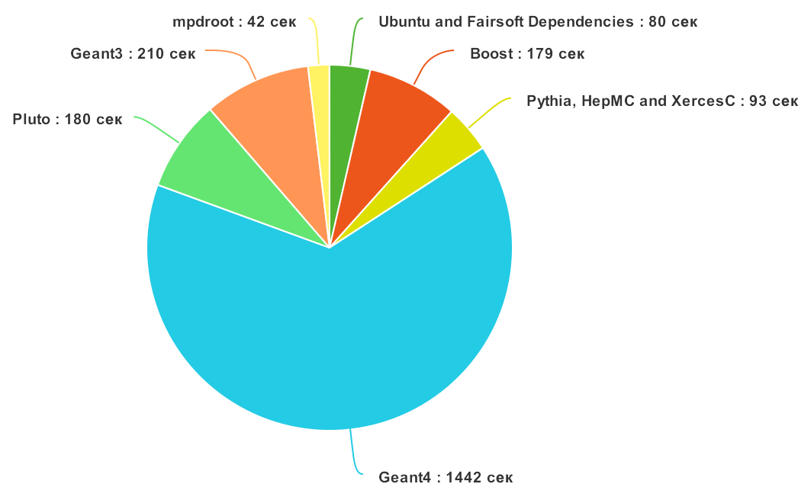
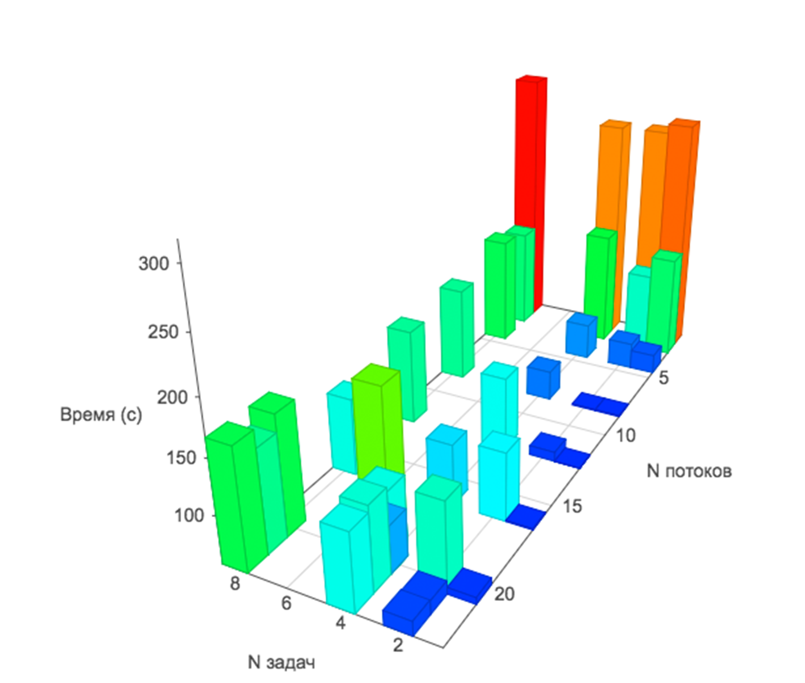

# Введение


**Системы непрерывной интеграции** - это программное обеспечение, созданное для автоматизированного тестирования програмных продуктов. Такие системы отслеживают атомарные изменения (коммиты) в системе контроля версий создаваемого продукта, и производят сборку и тестирование проекта в данном состоянии. В конце автоматизированного процесса сборки и тестирования разработчик получает либо положительный (ПО собралось и успешно прошло все этапы тестирования), либо отрицательный результат (возникла ошибка на каком-то этапе). Также разработчик может проследить весь процесс по генерируемым логам (журналам событий сборки и тестирования) и найти примерное место, в котором произошла ошибка. Необходимо заметить, что для таких систем наиболее важным параметром является время выполнения цикла сборки и тестирования. Удовлетворительным является время до 10 минут [3], но это также зависит и от масштабов проекта. Важно, чтобы разработчик получал как можно более быстрый отклик по изменениям, которые он внес в проект.
Системы непрерывной интеграции на сегодняшний день являются неотъемлемой частью крупных проектов по разработке ПО, а также добавляют удобства разработки для небольших проектов.

По сравнению с ручной сборкой и тестированием автоматические системы имеют ряд неоспоримых преимуществ:

* Весь процесс автоматизирован. Таким образом исключено влияние человека на процесс, а, следовательно, и связанные с этим фактором ошибки и неточности выполнения инструкций. Также у разработчика освобождается дополнительное время, которое он может потратить на разработку продукта.
* Однотипное, изолированное окружение – для каждой новой сборки создается выделенный контейнер, в котором создается окружение, где существует только то, что необходимо данному ПО и исключены влияния посторонних процессов.
* Сборка и тестирование на множестве платформ одновременно – для каждой целевой операционной системы можно создать виртуальную машину и/или контейнер и параллельно собирать и запускать тесты на разных ОС.
* Быстрота – программе не нужно тратить время на набор комманд и сверку с инструкциями.
* Автоматически генерируемые отчеты о сборках.

**Данная работа посвящена аспектам настройки системы непрерывной интеграции в рамках существующей инфраструктуры проекта MPD Root.**

**Проект MPD Root** — это набор программ и библиотек, позволяющих проводить симуляцию и анализ данных, полученных на Многоцелевом Детекторе (Multi Purpose Detector, MPD), созданном для изучения ядерной материи при экстремальных значениях плотности и температуры. Эксперимент MPD будет проводиться на создаваемом в ОИЯИ на основе Нуклотрона коллайдерном комплексе для ускорения тяжелых ионов (Nuclotron-based Ion Collider fAcility, NICA) [2].

# Определения

**Непрерывная интеграция (Continous Integration, CI)** — практика частой сборки и тестирования программного проекта с целью выявления ошибок на ранней стадии.

**Система контроля версий** — ПО для облегчения работы с изменяющейся информацией, позволяет хранить несколько версий одного документа и, при необходимости, возвращаться к более ранним, определять, кто и когда сделал то или иное изменение, а также многое другое.

**Репозиторий** — хранилище в системе контроля версий, отведенное под конкретный проект.

**Коммит** — объект, характеризующий изменения в репозитории.

**Docker-контейнер**— изолированная среда выполнения приложения, запущенная на базе операционной системы Linux.

**Образ (image) docker-контейнера** — объект, хранящий состояние docker-контейнера. При запуске контейнера указывается образ, на базе которого его нужно запустить.  

**Раннер** - сервер с установленным ПО для запуска задач непрерывной интеграции. 

**Программное окружение** — совокупность доступных для запуска программ в данной ОС.

**Сборка** — процесс компиляции ПО.

**Развертывание ПО**— процесс настройки и запуска ПО.

**Виртуальная машина** - это эмуляция компьютерной системы с помощью комбинации программных и аппаратных средств. Виртуальные машины основаны на компьютерной архитектуре и предоставляют функциональность физического компьютера.

**Приложение** - это компьютерная программа, созданная для выполнения определенных функций, необходимых пользователю.

**Лог-файлы** -   это файлы, в которые записываются события происходящие в операционной системе или других программах с привязкой ко времени.



# Постановка задачи

Пусть имеется 2 виртуальные машины [Windows Azure](https://azure.microsoft.com/) с установленной на ней ОС с ядром Linux: одна – для развертывания сервера **системы контроля версий** (Version Control System), вторая – для выполнения **процессов непрерывной интеграции** (Continuous Integration). 

Характеристики первого сервера (VCS):

```` 
●	CPU: Octa core Intel Xeon CPU E5-2673 v3 (-HT-MCP-) 2.40GHz
●	Количество ядер: 8
●	Потоков на ядро: 1
●	RAM: 28GB
●	SSD: 91.6GB
●	ОС: Ubuntu 14.04
````
Характеристики второго сервера (CI):

````
●	CPU: 20 cores Intel Xeon CPU E5-2673 v3 (-HT-MCP-) 2.40GHz
●	Количество ядер: 20
●	Потоков на ядро: 1
●	RAM: 140GB
●	SSD: 1TB
●	ОС: Ubuntu 14.04
````

Мы рассмотрим процесс развертывания и настройки обоих серверов.

Конечная система должна удовлетворять следующим требованиям:

* Сборка и тестирование должны производиться при каждом коммите
* Весь процесс сборки и тестирования должен описываться в текстовом файле(-ах), находящемся в репозиторий проекта и включенном в систему контроля версий (чтобы каждую сборку, при желании, было можно произвести по отдельному правилу)
* Процесс сборки и тестирования не должен в среднем занимать времени больше 10 минут [3]
* Каждая сборка должна производиться в выделенном контейнере
* По каждой сборке должен создаваться и храниться отчет
* Система должна легко развертываться на описанных выше серверах [1]

# Обзор использованных технологий

### GitLab CE

Это приложение с открытым исходным кодом, позволяющее развернуть свой сервис хранения репозиториев кода.  Сервис включает в себя удодбный веб-интерфейс для просмотра исходного кода, изменений, статистики и администрирования репозиториев. 

### GitLab CI Runner

Это приложение с открытым исходным кодом, созданное для запуска задач непрерывной интеграции. На рынке существует множество других решений для непрерывной интеграции, например: [Jenkins](https://jenkins.io/), [Travis-CI](https://travis-ci.org/), [Bamboo](https://ru.atlassian.com/software/bamboo) и др. Для реализации задачи был выбран GitLab CI Runner, так как этот инструмент легко интегрируется с менеджером репозиториев GitLab.

К GitLab-репозиторию можно привязать множество удаленных серверов с установленным GitLab CI Runner, которые будут выполнять задачи построения и тестирования. На данный момент существуют 2 типа раннеров: *Shared* и *Specific* [4].  
 **Specific-раннеры** в основном используются для построения проектов, у которых есть особые требования (например, по использованию ресурсов компьютера), и поэтому могут быть привязаны только к одному проекту.  
**Shared-раннеры** могут быть привязаны к множеству проектов. 


### Docker
Это проект с открытым исходным кодом, созданный для развертывания приложений внутри программных контейнеров. 
Docker предоставляет дополнительный уровень абстракции от других процессов на уровне операционной системы. Docker также позволяет запускать несколько независимых контейнеров на одной операционной системе одновременно и, в отличии от виртуальных машин, не теряет время на старт полноценной гостевой операционной системы.  
Docker — это фреймворк виртуализации, сфокусированный не вокруг эмуляции аппаратных средств, а вокруг запуска приложений [5].

В данной работе Docker используется как инструмент для изоляции параллельно запущенных задач непрерывной интеграции друг от друга.
Docker на данный момент является одной из самых популярных и развивающихся технологий контейнеризации приложений, что гарантирует наличие подробной документации и поддержки сообщества, поэтому данная технология и была выбрана для решения поставленной задачи.


# Развертывание и настройка


Для сервера контроля версий был скачан и установлен пакет GitLab Community Edition. Сразу после установки становится доступен веб-интерфейс, в котором и производится дальнейшая настройка.  Первым делом интерфейс предлагает выбрать пароль для пользователя ``root``. Далее необходимо добавить новый проект. В нашем случае проект был скопирован из существующего репозитория по адресу
<https://git.jinr.ru/nica/mpdroot.git>. Далее, чтобы менеджер репозиториев был доступен из Интернет, необходимо открыть на сервере 80 порт. На этом этапе настройку сервера контроля версий можно считать завершенной. 

Далее был настроен сервер сборки и тестирования. Для этого был скачен и установлен пакет ``gitlab-ci-multi-runner``. После установки раннер, с помощью специальной команды, был зарегистрирован на сервере контроля версий.  В процессе регистрации потребовался специальный токен, доступный в веб-интерфейсе сервера контроля версий. В качестве режима запуска задач построения и тестирования был выбран режим ``shell``. Этот режим дает возможность более гибкого управления процессом CI.   
После регистрации, в соответствии с задачей, были настроены параметры раннера. Были увеличины лимиты на время и размер лог-файлов. Также раннеру были даны дополнительные привелегии для исполнения команд без ввода пароля. В завершающей стадии настройки сервера построения и тестирования был установлен Docker.

Для описания процесса непрерывной интеграции в корне репозитория проекта MPD Root были созданы 2 файла: ``.gitlab-ci.yml`` и ``Dockerfile``. Первый файл используется для описания стадий процесса  непрерывной интеграции, а также всех выполняемы на каждой стадии действий. Второй файл служит описанием образа Docker-контейнера, в котором будет выполняться CI-процесс.

В Dockerfile была описана установка в контейнер следующих компонентов: Ubuntu 14.04, зависимостей FairSoft и самого пакета FairSoft. Также в конце файла было описано копирование всех файлов репозитория в контейнер. Каждое из вышеприведенных действий установки является отдельной командой. Докер-образы созданы так, что после выполнения каждой из команд создается новый слой образа поверх предыдущего (контрольная точка). Так при первой компиляции образа с помощью созданного Dockerfile выполнятся все  описанные команды. Но в дальнейшем, при изменении Dockerfile, перезапись слоев образа будет производиться только начиная с измененных (в Dockerfile) команд. Также есть особый тип команд ``ADD``, после которых перезапись следующих слоев образа будет произведена в любом случае. Эти команды служат для копирования файлов в контейнер. Поэтому, в нашем случае, команда ``ADD`` копирования файлов репозитория MPD Root в контейнер была описана в самом конце Dockerfile.   
Таким образов система слоев в docker-образе позволила сэкономить ощутимое время компиляции зависимостей. Зависимости компилируются только в первый раз, а дальше хранятся установленными в docker-образе, готовыми для записи поверх них слоя с основным софтом.  

В файле ``.gitlab-ci.yml``, также лежащем в корне репозитория были описаны 3 стадии CI-процесса: построение, тестирование и очистка. Стадия построения была разбита на 2 части: компиляция образа с помощью Dockerfile и компиляция MPD Root внутри контейнера, используюущего скомпилированный образ.
После компиляции MPD Root, новый слой опять сохранялся в образ и использовался уже в новом контейнере на стадии тестирования. После стадии тестирования, на стадии очистки, производилось освобождение ресурсов, выделенных под контейнеры, а также удаление ненужных образов. Сохранялся только образ с установленным FairSoft.


# Эксперименты
Были проведены эксперименты для выявления плюсов кэширования зависимостей, а также работоспособности системы в зависимосмти от нагрузки и выделенных ресурсов.  
В начале был рассмотрен процесс сборки "с нуля" по шагам. На графиках ниже представлены 4 параметра системы сборки (загрузка процессора, сети, опреативной памяти и диска) в зависимости от времени. Также отмечены важные этапы сборки и, в некоторых случаях, указано время до старта этапа с начала сборки.

>  (1) - (2) - установка Ubuntu и зависимостей для FairSoft  
>  (2) - (3) - установка библиотеки Boost  
> (3) - (4) - компиляция Pythia, HepMC и XercesC  
> (4) - (6) - установка Geant4; (5) - загрузка данных для Geant4 из Интернет  
> (6) - (7) - компиляция Root  
> (7) - (8) -  сборка Pluto  
> (8) - (9) - установка Geant 3  
> (9) - начало построения mpdroot  


На следующем графике наглядно представлено время, которое занимает каждый этап сборки:

По графикам видно, что основное время занимает сборка зависимостей для проекта MPD Root. Очевидным решением для достижения минимального времени сборки является кэширование результатов сборки зависимостей, что и было сделано. В этом помогла, реализованная в Docker, система кэширования образов контейнера. Зависимости собираются с нуля только при изменении их описания. При условии неизменности зависимостей, каждая следующая сборка основного проекта будет запущена в контейнере, воссозданном из образа со всеми необходимыми передустановленными программами. Такая организация процесса позволила снизить время сборки в среднем с более чем 45 до 2-5 минут для второй и последующих сборок с одинаковыми зависимостями.    
Кроме того на этапах сборки Geant4 (4-6) и Pluto (7-8) заметна крайне низкая загрузка CPU. Оптимизация параметров сборки этих пакетов должа позволить еще больше снизить время сборки "с нуля".

Далее были проведены эксперименты без сборки зависимостей.  Целью этих экспериментов было выяснить, как зависит время сборки основного проекта от числа одновременно запущенных задач построения и числа выделенных на это потоков на CPU. Результаты экспериментов представлены на графике ниже:

>  Минимальное время сборки - 56 секунд .

Из графика видно, что, вне зависимости от количества задач, необходимо давать системе больше 5 потоков, иначе время сборки будет неоправданно высоким. В этих условиях стабильно быстро выполняются отдельные задачи. При добавлении второй и более одновременных задач, сборки идут заметно медленнее.

# Заключение
В ходе работы удалось настроить систему непрерывной интеграции для построения и тестирования проекта MPD Root.
Одним из основных принципов систем CI является принцип быстроты сборки — разработчик должен мгновенно убедится в работоспособности своих изменений и, в случае ошибок, внести исправления на ранней стадии. Поэтому время сборки является основным параметром, который необходимо оптимизировать.

В проектах со сложными зависимостями самое заметное сокращение времени сборки дает кэширование этих зависимостей. В данной работе кэширование сборки зависимостей позволило сократить время сборки с 45 до 2-5 минут. На втором месте по эффекту от оптимизациив данной работе стоит метод распараллеливания CI-процесса. Из проведенных экспериментов следует, что для данной задачи построения проекта MPD Root оптимально использовать более 5 параллельных потоков.  
Также, очевидно, что увеличение количества CI-серверов (при вынесении их на отдельные машины) даст возможность выполнять большее число CI-задач одновременно без создания дефицита ресурсов.


# Список литературы
1.	Fowler M., Foemmel M. Continuous integration, <http://martinfowler.com/articles/continuousIntegration.html>
2.	Многоцелевой Детектор - MPD (концептуальный дизайн-проект), <http://nica.jinr.ru/files/CDR_MPD/MPD_CDR_ru.pdf>
3.	Непрерывная интеграция, <http://lib.custis.ru/Непрерывная_интеграция>
4.	GitLab Documentation, <https://docs.gitlab.com/ce/ci/runners/README.html>
5.  	Fink J. Docker: A software as a service, operating system-level virtualization framework //Code4Lib Journal. – 2014. – Т. 25.

