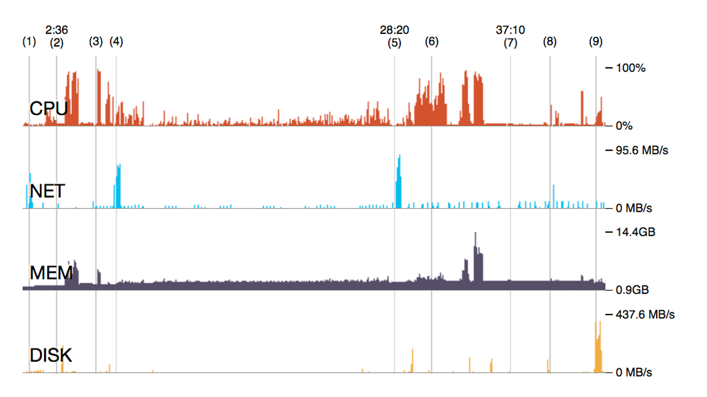
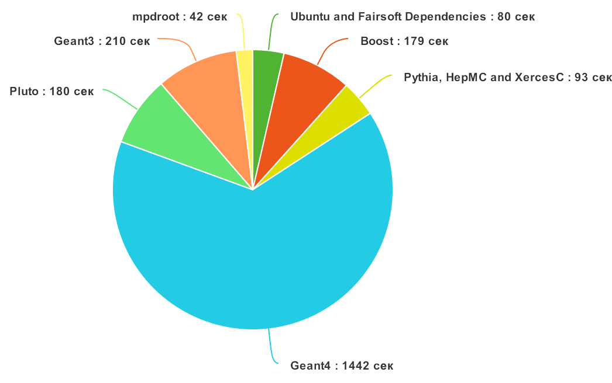
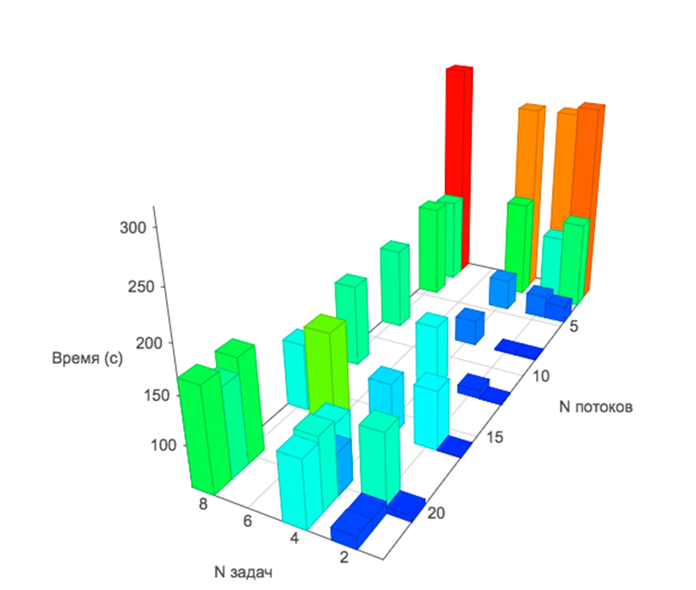

# Введение


**Системы непрерывной интеграции** - это программное обеспечение, созданное для автоматизированного тестирования програмных продуктов. Такие системы отслеживают атомарные изменения (коммиты) в системе контроля версий создаваемого продукта, и производят сборку и тестирование проекта в данном состоянии. В конце автоматизированного процесса сборки и тестирования разработчик получает либо положительный (ПО собралось и успешно прошло все этапы тестирования), либо отрицательный результат (возникла ошибка на каком-то этапе). Также разработчик может проследить весь процесс по генерируемым логам (журналам событий сборки и тестирования) и найти примерное место, в котором произошла ошибка. Необходимо заметить, что для таких систем наиболее важным параметром является время выполнения цикла сборки и тестирования. Удовлетворительным является время до 10 минут [3], но это также зависит и от масштабов проекта. Важно, чтобы разработчик получал как можно более быстрый отклик по изменениям, которые он внес в проект.
Системы непрерывной интеграции на сегодняшний день являются неотъемлемой частью крупных проектов по разработке ПО, а также добавляют удобства разработки для небольших проектов.

По сравнению с ручной сборкой и тестированием автоматические системы имеют ряд неоспоримых преимуществ:

* Весь процесс автоматизирован. Таким образом исключено влияние человека на процесс, а, следовательно, и связанные с этим фактором ошибки и неточности выполнения инструкций. Также у разработчика освобождается дополнительное время, которое он может потратить на разработку продукта.
* Однотипное, изолированное окружение – для каждой новой сборки создается выделенный контейнер, в котором создается окружение, где существует только то, что необходимо данному ПО и исключены влияния посторонних процессов.
* Сборка и тестирование на множестве платформ одновременно – для каждой целевой операционной системы можно создать виртуальную машину и/или контейнер и параллельно собирать и запускать тесты на разных ОС.
* Быстрота – программе не нужно тратить время на набор комманд и сверку с инструкциями.
* Автоматически генерируемые отчеты о сборках.

**Данная работа посвящена аспектам настройки системы непрерывной интеграции в рамках существующей инфраструктуры проекта MPD Root.**

**Проект MPD Root** — это набор программ и библиотек, позволяющих проводить симуляцию и анализ данных, полученных на Многоцелевом Детекторе (Multi Purpose Detector, MPD), созданном для изучения ядерной материи при экстремальных значениях плотности и температуры. Эксперимент MPD будет проводиться на создаваемом в ОИЯИ на основе Нуклотрона коллайдерном комплексе для ускорения тяжелых ионов (Nuclotron-based Ion Collider fAcility, NICA) [2].

# Определения

**Непрерывная интеграция (Continous Integration, CI)** — практика частой сборки и тестирования программного проекта с целью выявления ошибок на ранней стадии.

**Система контроля версий** — ПО для облегчения работы с изменяющейся информацией, позволяет хранить несколько версий одного документа и, при необходимости, возвращаться к более ранним, определять, кто и когда сделал то или иное изменение, а также многое другое.

**Репозиторий** — хранилище в системе контроля версий, отведенное под конкретный проект.

**Коммит** — объект, характеризующий изменения в репозитории.

**Docker-контейнер**— изолированная среда выполнения приложения, запущенная на базе операционной системы Linux.

**Образ (image) docker-контейнера** — объект, хранящий состояние docker-контейнера. При запуске контейнера указывается образ, на базе которого его нужно запустить.

**Программное окружение** — совокупность доступных для запуска программ в данной ОС.

**Сборка** — процесс компиляции ПО.

**Развертывание ПО**— процесс настройки и запуска ПО.

**Виртуальная машина** - 

**Приложение** - 


# Постановка задачи

Пусть имеется 2 виртуальные машины [Windows Azure](https://azure.microsoft.com/) с установленной на ней ОС с ядром Linux: одна – для развертывания сервера **системы контроля версий**, вторая – для выполнения **процессов построения** приложения. 

Характеристики первого сервера (VCS):

```` 
●	CPU: Octa core Intel Xeon CPU E5-2673 v3 (-HT-MCP-) 2.40GHz
●	Количество ядер: 8
●	Потоков на ядро: 1
●	RAM: 28GB
●	SSD: 91.6GB
●	ОС: Ubuntu 14.04
````
Характеристики второго сервера (CI):

````
●	CPU: 20 cores Intel Xeon CPU E5-2673 v3 (-HT-MCP-) 2.40GHz
●	Количество ядер: 20
●	Потоков на ядро: 1
●	RAM: 140GB
●	SSD: 1TB
●	ОС: Ubuntu 14.04
````

Мы рассмотрим процесс развертывания и настройки обоих серверов.

Конечная система должна удовлетворять следующим требованиям:

* Сборка и тестирование должны производиться при каждом коммите
* Весь процесс сборки и тестирования должен описываться в текстовом файле(-ах), находящемся в репозиторий проекта и включенном в систему контроля версий (чтобы каждую сборку, при желании, было можно произвести по отдельному правилу)
* Процесс сборки и тестирования не должен в среднем занимать времени больше 10 минут [3]
* Каждая сборка должна производиться в выделенном контейнере
* По каждой сборке должен создаваться и храниться отчет
* Система должна легко развертываться на описанных выше серверах [1]

# Обзор использованных технологий

### GitLab CE

Это [приложение](https://gitlab.com/gitlab-org/gitlab-ce) с открытым исходным кодом, позволяющее развернуть свой сервис хранения репозиториев кода.  Сервис включает в себя удодбный веб-интерфейс для просмотра исходного кода, изменений, статистики и администрирования репозиториев. 

### GitLab CI Runner

Это [приложение](https://about.gitlab.com/gitlab-ci/) с открытым исходным кодом, созданное для запуска задач непрерывной интеграции. На рынке существует множество других решений для непрерывной интеграции, например: [Jenkins](https://jenkins.io/), [Travis-CI](https://travis-ci.org/), [Bamboo](https://ru.atlassian.com/software/bamboo) и др. Для реализации задачи был выбран GitLab CI Runner, так как этот инструмент легко интегрируется с менеджером репозиториев GitLab.

К GitLab-репозиторию можно привязать множество удаленных серверов с установленным GitLab CI Runner, которые будут выполнять задачи построения и тестирования. На данный момент существуют [2 типа раннеров](http://docs.gitlab.com/ce/ci/runners/README.html): *Shared* и *Specific*.  
 **Specific-раннеры** в основном используются для построения проектов, у которых есть особые требования (например, по использованию ресурсов компьютера), и поэтому могут быть привязаны только к одному проекту.  
**Shared-раннеры** могут быть привязаны к множеству проектов.  Далее в соответствующем разделе будет рассмотрен процесс настройки и подключения такого раннера.


### Docker
Это [проект](https://www.docker.com/) с открытым исходным кодом, созданный для развертывания приложений внутри программных контейнеров. 
Docker предоставляет дополнительный уровень абстракции от других процессов на уровне операционной системы. Docker также позволяет запускать несколько независимых контейнеров на одной операционной системе одновременно и, в отличии от виртуальных машин, не теряет время на старт полноценной гостевой операционной системы.  
Docker — это фреймворк виртуализации, сфокусированный не вокруг эмуляции аппаратных средств, а вокруг запуска приложений [4].

В данной работе Docker используется как инструмент для изоляции параллельно запущенных задач непрерывной интеграции друг от друга.
Docker на данный момент является одной из самых популярных и развивающихся технологий контейнеризации приложений, что гарантирует наличие подробной документации и поддержки сообщества, поэтому данная технология и была выбрана для решения поставленной задачи.


# Развертывание и настройка сервера контроля версий

Сначала необходимо установить несколько зависимостей:

```` bash
sudo apt-get install curl openssh-server ca-certificates postfix
````
> При запросе дополнителных сведений выбираем все по умолчанию

Далее  с помощью выполнения удаленного скрипта добавляем источник загрузки основного пакета:

```` bash
curl -sS https://packages.gitlab.com/install/repositories/gitlab/gitlab-ce/script.deb.sh | sudo bash
````
Наконец, устанавливаем GitLab CE:

````` bash
sudo apt-get install gitlab-ce
`````
Для настройки запускаем команду

```` bash
sudo gitlab-ctl reconfigure
````
Теперь можно открыть браузер и получить доступ к веб-интерфейсу по адресу <http://localhost/>, либо по внешнему IP-адресу компьютера.
> Чтобы удаленно получить доступ к веб-интерфейсу необходимо открыть 80 порт.

При первом запуске веб-интерфейса необходимо выбрать пароль администратора (для пользователя **root**).

Теперь нам доступен интерфейс для создания, просмотра и администрирования репозиториев. Существует также опция импорта готовых репозиториев из других систем.  
Для наших целей импортируем по ссылке существующий репозиторий проекта MPD Root (<https://git.jinr.ru/nica/mpdroot.git>). На этом этапе развертывание системы контроля версий завершено.


# Развертывание и настройка сервера сборки и тестирования
Перед установкой добавим источник установочного пакета:

```` bash
curl -L https://packages.gitlab.com/install/repositories/runner/gitlab-ci-multi-runner/script.deb.sh | sudo bash
````
Затем установим раннер:

```` bash
sudo apt-get install gitlab-ci-multi-runner
````
Далее нужно зарегистрировать раннер и привязать его к серверу репозитория. Для этого выполним команду `` sudo gitlab-ci-multi-runner register``. 

В процессе регистрации несколько шагов:  

1. Вводим адрес сервера репозитория `` http://<IP-адрес-сервера-репозитория>/ci``
2. Вводим токен,  который получаем на странице `` http://<IP-адрес-сервера-репозитория>/admin/runners``
3. Вводим название раннера, например, Main Runner
4. Теги - теги коммитов, на которые будет срабатывать CI процесс. Чтобы процесс запускался по каждому коммиту - ничего не вводим.
5. Executor =  **shell**. Этот режим дает возможность более гибкого управления процессом CI. Далее это понадобится, например, для отчистки кэша Docker'a. Также на данный момент имеются режимы *docker*, *docker-ssh* и *ssh*.

После регистрации раннера необходимо подключить его к конкретному репозиторию (mpdroot). Для этого открываем в браузере страницу ``http://<IP-адрес-репозитория>/admin/runners``, выбираем Edit напротив только что подключеного раннера  и напротив нужного репозитория нажимаем Enable. Галочка ``Run untagged jobs`` должна быть активна, чтобы процесс запускался по каждому коммиту.

Далее необходимо настроить параметры раннера. Для этого любым текстовым редактором открываем файл кофигурации:

```` bash
nano /etc/gitlab-runner/config.toml
````

В общем разделе изменяем значение поля **concurrent** на 8. Это позволит запускать 8 CI задач параллельно. Далее нам это понадобится для проведения экспериментов, по загрузке ресурсов сервера.  
В разделе  [[runners]] добавляем поля и соответствующие значения ``output_limit = 10240`` и ``timeout = 5400``.  
> Задача построения проекта mpdroot с нуля занимает до 40 минут и имеет большое количество вывода, и если  не выставить данные настройки, то могут возникнуть такие проблемы как отсутствие вывода после некоторого момента и зависание процесса.

Пример содержания файла ` /etc/gitlab-runner/config.toml`:

```` bash
concurrent = 8 # разрешаем запуск 8 CI задач параллельно
[[runners]]
  name = "Main Runner"
  url = "http://<IP-адрес-сервера-репозитория>/ci"
  token = "<токен-сервера-репозитория>"
  executor = "shell"
  output_limit = 10240 # лимит лога - 10 мегабайт
  timeout = 5400 # лимит времени на  одну CI задачу в секундах
  [runners.ssh]
  [runners.docker]
    tls_verify = false
    image = ""
    privileged = false
    disable_cache = false
  [runners.parallels]
    base_name = ""
    disable_snapshots = false
  [runners.virtualbox]
    base_name = ""
    disable_snapshots = false
  [runners.cache]
    Insecure = false

````

Чтобы CI скрипт мог выполять команды с модификатором ``sudo`` (далее это потребуется для выполнения некоторых CI комманд), необходимо разрешить пользователю ``gitlab-runner`` выполянять ``sudo`` без пароля. Для этого выполним команду

 ```
 visudo
 ```
и добавим строчку ``gitlab-runner ALL=(ALL) NOPASSWD: ALL`` в открывшийся файл.


Далее для наших целей нужно установить Docker. Для этого зупускаем установку через удаленный скрипт:

```
curl -sSL https://get.docker.com/ | sh
```
Теперь осталось написать сами CI скрипты и все будет готово для запуска CI задач.

# Создание скриптов сборки и тестирования
Чтобы срабатывал процесс непрерывной интеграции в GitLab CI, необходимо, чтобы в корне проекта (репозитория) находился файл ``.gitlab-ci.yml``. 

Кроме того в корне проекта мы еще создадим файл ``Dockerfile`` в котором будет описываться конфигурация эмулируемой докером системы и прописываться установка всех зависимостей для mpdroot.

Итак, начнем с ``Dockerfile``:

``` bash
# Этот файл содержит описание образа системы (окружения), 
# в котором будет производится построение и тестирование
# проекта mpdroot.

### О КЭШИРОВАНИИ:
#  Результаты docker-команд кэшируются, но существуют обстоятельства, 
#  при которых кэш не используется:
#  - команда была измененна в Dockerfile
#  - команда  является командой ADD (копирование файлов в контейнер).
#  Если кэш не использовался для какой-то команды, то и все 
#  последующие команды не используют кэш.

#  Кэширование образов Docker позволяет добиться существенного
#  сокращения времени построения. Например, для 
#  проекта mpdroot это позволяет сократить время построения 
#  c 40 до 5 минут.


# Начнем описание образа:

# Образ на котором будет основываться наш образ
# - образ системы Ubunty 14.04, который будет скачен с публичного
# репозитория образов Docker.
FROM ubuntu:14.04

# На этом этапе в образе у нас установлена ОС и мы можем
# выполнять команды по установке зависимостей проекта.

# Для сборки mpdroot необходим FairRoot
# Сначала установим зависимости для FairRoot
RUN apt-get update
RUN sudo apt-get install cmake cmake-data g++ gcc gfortran \
  build-essential make patch sed libx11-dev libxft-dev \
  libxext-dev libxpm-dev libxmu-dev libglu1-mesa-dev \
  libgl1-mesa-dev ncurses-dev curl bzip2 gzip unzip tar \
  subversion git xutils-dev flex bison lsb-release \
  python-dev libxml2-dev wget libssl-dev \
  libcurl4-openssl-dev automake autoconf libtool -y

### Установка FairSoft

# Колонируем проект FairSoft из его репозитория по тегу 'mar15p6'.
# В дальнейшем можно будет изменить этот тег (обновить версию FairSoft)
# И коммит, содержащий это обновление Dockerfile'a автоматически запустит
# CI процесс с обновленной версией (кэш не будет использован с этого момента).
RUN cd /opt; \
  git clone https://github.com/FairRootGroup/FairSoft.git fairsoft; \
  cd fairsoft; \
  git checkout mar15p6; \
  
# Создадим config файл с нужными параметрами, чтобы потом передать
# его как параметр для установки FairRoot:
  sudo rm -rf fs_inst_settings; \        
  echo "compiler=gcc" >> fs_inst_settings; \
  echo "debug=no" >> fs_inst_settings; \
  echo "optimize=yes" >> fs_inst_settings; \
  echo "geant4_download_install_data_automatic=yes" >> fs_inst_settings; \
  echo "geant4_install_data_from_dir=no" >> fs_inst_settings; \
  echo "build_python=yes" >> fs_inst_settings; \
  echo "install_sim=yes" >> fs_inst_settings; \
  echo "SIMPATH_INSTALL=$(pwd)/install" >> fs_inst_settings; \
  echo "platform=linux" >> fs_inst_settings; \

# Установим FairSoft
  ./configure.sh fs_inst_settings;

# Скопируем репозиторий mpdroot в отдельную папку в образе:
ADD ./ /repo_root/

```


Перейдем к CI скрипту.  

``.gitlab-ci.yml``:

``` bash
# В начале объявляем этапы CI процесса, 
# которые потом будем описывать.
# Для каждого этапа можно описать несколько задач. 
# Задачи одного этапа выполняются параллельно, задачи следующего
# этапа не выполняются, пока не выполнены все задачи текущего этапа.

stages:
  - build
  - test
  - cleanup 
 
# Далее опишем первую задачу - построение проекта.
# Каждая задача должна содержать поле script.
# В скриптах команды пишутся  с новой строки. 
# Перед командой ставится дефис и пробел:
#  - <команда>
# Также допустимы многострочные команды:
# - | 
#    command1;
#    command2;

build_mpd: # название задачи
  stage: build # этап, к которому принадлежит задача
  before_script: 
    # Предварительные действия перед основным скриптом этой задачи:
    # Построим образ Docker используя Dockerfile который лежит
    # в той же папке, что и данный файл. 
    - sudo docker build -t ci-env-$CI_PROJECT_ID .
  script: 
    # Запускаем Docker-контейнер, используя только
    # что построенный образ, и передаем в него команды
    # на построение mpdroot внутри контейнера.
    - |
      sudo docker run -i ci-env-$CI_PROJECT_ID /bin/bash -s <<EOF 

      cd repo_root
      mkdir build
      . SetEnv.sh
      cd build
      cmake ..
      # Основная команда построения.
      # Параметр -jN указывает количество параллельных потоков
      # на которых будет проводится построение. 
      # Оптимально выбирать N = количеству ядер процессора. (ИСТОЧНИК?)
      make -j20 
      . config.sh      
      EOF
      

    - echo "Project ID is $CI_PROJECT_ID"
      # после найдем id контейнера
    - CONTAINER_ID=$(sudo docker ps -a | awk '{ print $1,$2 }' | grep ci-env-$CI_PROJECT_ID | awk '{print $1}' | head -1)
    - echo $CONTAINER_ID;
      # и сохраним изменения (построенный mpdroot) в образ,
      # чтобы потом использовать его в задаче тестирования.
    - sudo docker commit $CONTAINER_ID ci-build-$CI_BUILD_REF
    - echo "ci-build-$CI_BUILD_REF"

# Далее опишем задачу тестирования
test_mpd:
  stage: test
  script:
    - |               
      # Запустим еще один Docker-контейнер, используя образ,
      # который мы сохранили на этапе построения.
      sudo docker run -i ci-build-$CI_BUILD_REF /bin/bash -s <<EOF 
      -e;
      cd repo_root/build      
      . config.sh      
      ctest -VV # запустим тесты проекта mpdroot
      EOF        

# Этап очистки образов и контейнеров
clean_allocated_container:
  stage: cleanup
  script:    
   # Удалим образ с построенным mpdroot (он нам больше не понадобится)
    - for i in `sudo docker images|grep ci-build-$CI_BUILD_REF |awk '{print $3}'`;do sudo docker rmi -f $i;done    
    # Удалим промежуточные (none) образы
    - for i in `sudo docker images|grep none |awk '{print $3}'`;do sudo docker rmi $i;done || true;    
    # Удалим Exited и Dead контейнеры
    - sudo docker rm `sudo docker ps -a | grep Exited | awk '{print $1 }'` || true;
    - sudo docker rm `sudo docker ps -a | grep Dead | awk '{print $1 }'` || true;
```

# Эксперименты




### Вывод
# Заключение

# Список литературы
1.	Fowler M., Foemmel M. Continuous integration) <http://martinfowler.com/articles/continuousIntegration.html>
2.	Многоцелевой Детектор - MPD (концептуальный дизайн-проект) <http://nica.jinr.ru/files/CDR_MPD/MPD_CDR_ru.pdf>
3.	Непрерывная интеграция, http://lib.custis.ru/Непрерывная_интеграция
4.	Fink J. Docker: A software as a service, operating system-level virtualization framework //Code4Lib Journal. – 2014. – Т. 25.

